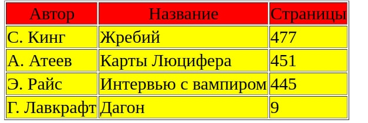

# Задание

Написать скрипт вывода в виде [таблиц](https://knureigs.github.io/itech/lb/ITech1_PHP/images/table.JPG) информации, взятой из файла. Предусмотреть формат хранения такой информации, чтобы её было удобно отображать в виде таблиц. Рекомендуется познакомиться с форматом CSV (но никто не мешает использовать и свои произвольные разделители).

